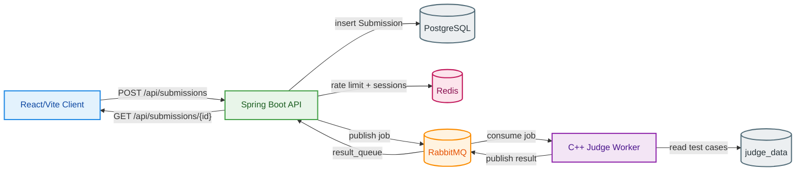

# Distributed Code Judge

End-to-end, locally runnable online judge with support for multiple programming languages:

- **React/Vite frontend** for submitting code, browsing problems, and polling results.
- **Spring Boot API** for authentication, storing submissions, and managing problems.
- **RabbitMQ** for asynchronous job dispatching between backend and workers.
- **C++ worker containers** (scalable) that compile/run submissions against test cases and publish verdicts.
- **PostgreSQL** for persistent storage of problems, submissions, and user accounts.

Supported languages: **C++, Python, Java**

## Repository layout

- [client/](client/) — React + Vite UI (see [client/README.md](client/README.md))
- [code_judge/](code_judge/) — Spring Boot API (see [code_judge/HELP.md](code_judge/HELP.md))
- [CodeExecutor/](CodeExecutor/) — C++ judge-worker container
- [judge_data/](judge_data/) — Test cases directory (mounted into workers)
- [docker-compose.yml](docker-compose.yml) — PostgreSQL + RabbitMQ + worker services
- [stress_test.py](stress_test.py) — Load generator for testing the submit endpoint
- [README.md](README.md) — This file

## Directory structure

```
.
├── client/                 # React/Vite UI
├── code_judge/             # Spring Boot API
├── CodeExecutor/           # C++ judge worker (Docker image)
├── judge_data/             # Local test cases (mounted into worker)
├── docker-compose.yml      # Postgres + RabbitMQ + worker services
├── stress_test.py          # Submit endpoint load generator
└── README.md
```

## Architecture (high level)

1. The frontend calls the backend `POST /api/submissions` with code, `problemId`, and language.
2. The backend stores a `Submission` with status `PENDING` and publishes a job to RabbitMQ (`submission_queue`).
3. A C++ worker consumes the job, runs it against test cases, and publishes a result to `result_queue`.
4. The backend listens to `result_queue` and updates the `Submission` as `COMPLETED`.

Frontend notes:

- Problem descriptions render Markdown with KaTeX math support.
- Problem list uses a popover drawer to keep the editor width stable.
- Code editor uses Monaco editor with template code for quick start.

### Architecture diagram (Mermaid)



## Local development

### Prerequisites

- Docker Desktop (for Postgres/RabbitMQ/worker)
- Node.js 18+ (for the frontend)
- JDK 25 (the backend declares `java.version=25` in [code_judge/pom.xml](code_judge/pom.xml))

### Ports

- Backend API: `http://localhost:8080`
- Frontend dev server: `http://localhost:5173`
- Postgres: `localhost:5433` (mapped to container `5432`)
- RabbitMQ AMQP: `localhost:5672`
- RabbitMQ management UI: `http://localhost:15672` (default creds `guest` / `guest`)

### 1) Start infrastructure

From the repo root, start the required services (PostgreSQL, RabbitMQ, and workers):

```bash
# Start containers in background
docker compose up -d postgres rabbitmq

# Build and scale worker containers (default: 5 replicas)
docker compose up -d --build judge-worker

# Or scale to a different number (e.g., 10 workers)
docker compose up -d --build --scale judge-worker=10 judge-worker
```

**Note:** The `docker-compose.yml` file contains service definitions. Verify that PostgreSQL is accessible at `localhost:5433` and RabbitMQ at `localhost:5672` before starting the backend.

To verify services are running:
```bash
docker compose ps
# Should show: postgres, rabbitmq, and judge-worker containers with status "running"
```

### 2) Run the backend (Spring Boot)

From the repo root:

- `cd code_judge`
- Windows: `mvnw.cmd spring-boot:run`
- macOS/Linux: `./mvnw spring-boot:run`

The backend reads connection settings from [code_judge/src/main/resources/application.properties](code_judge/src/main/resources/application.properties) and is preconfigured for the Docker Compose ports.

**Note:** The backend depends on:
- PostgreSQL at `localhost:5433` (see [docker-compose.yml](docker-compose.yml))
- RabbitMQ at `localhost:5672` (see [docker-compose.yml](docker-compose.yml))
- Redis at `localhost:6379` for rate limiting and session storage (see [docker-compose.yml](docker-compose.yml))

Verify all services are running before starting the backend:
```bash
docker compose ps  # Should show: postgres, rabbitmq, redis (all "running")
```

### 3) Create a Problem and upload test cases

Submissions reference a `problemId`. Create a problem first, then upload a zip of test cases.

Create a problem:

```bash
curl -X POST http://localhost:8080/api/admin/problems \
  -H "Content-Type: application/json" \
  -H "Authorization: Bearer <token>" \
  -d '{
    "title": "Sample: Add One",
    "description": "Read an integer and output x + 1.",
    "slug": "add-one",
    "difficulty": "EASY",
    "timeLimitSeconds": 2,
    "memoryLimitMb": 256
  }'
```

Upload test cases for `problemId=1`:

```bash
curl -X POST http://localhost:8080/api/admin/problems/1/testcases \
  -H "Authorization: Bearer <token>" \
  -F "file=@/path/to/testcases.zip"
```

Zip layout requirements:

- Files must be named `1_in.txt`, `1_out.txt`, `2_in.txt`, `2_out.txt`, etc.
- The backend extracts to `judge.data.path` (configure in `code_judge/src/main/resources/application.properties`).
- The worker reads test cases from `JUDGE_DATA_DIR` (set in `docker-compose.yml`; defaults to `./judge_data` inside the container).

### 4) Run the frontend

From the repo root:

- `cd client`
- `npm install`
- `npm run dev`

The backend enables CORS for `http://localhost:5173` (see `@CrossOrigin` in the submission controller).

## API

### Authentication

All endpoints except `/api/auth/**` require a JWT bearer token in the `Authorization` header.

**Register a new user:**
- `POST http://localhost:8080/api/auth/register`
- Request body: `{ "username": "...", "email": "...", "password": "..." }`
- Response: `{ "username": "...", "email": "..." }`

**Login:**
- `POST http://localhost:8080/api/auth/login`
- Request body: `{ "email": "...", "password": "..." }`
- Response: `{ "token": "...", "username": "..." }`

Example:
```bash
curl -X POST http://localhost:8080/api/auth/login \
  -H "Content-Type: application/json" \
  -d '{
    "email": "demo@example.com",
    "password": "password123"
  }'
```

Use the returned `token` as a Bearer token for all protected endpoints:
```bash
curl -H "Authorization: Bearer <token>" http://localhost:8080/api/...
```

### Problems

**Get all problems:**
- `GET /api/problems/`
- Returns: Array of problems with metadata

**Get problem details:**
- `GET /api/problems/{id}`
- Returns: Single problem with title, description, constraints

**Create a problem (admin):**
- `POST /api/admin/problems`
- **Note:** Currently unrestricted. Should be protected with admin role.
- Request body:
  ```json
  {
    "title": "Add One",
    "description": "Read an integer and output x + 1.",
    "slug": "add-one",
    "difficulty": "EASY",
    "timeLimitSeconds": 2,
    "memoryLimitMb": 256
  }
  ```

**Upload test cases (admin):**
- `POST /api/admin/problems/{id}/testcases`
- **Note:** Currently unrestricted. Should be protected with admin role.
- Multipart form data: `file` = zip archive
- Zip must contain files named: `1_in.txt`, `1_out.txt`, `2_in.txt`, `2_out.txt`, etc.
- Files are extracted to the directory configured in `application.properties` (default: `./judge_data`)

### Submissions

**Submit code:**
- `POST /api/submissions`
- Supported languages: `cpp`, `python`, `java`
- Request body:
  ```json
  {
    "problemId": 1,
    "language": "cpp",
    "code": "#include <bits/stdc++.h>\nint main() { ... }"
  }
  ```
- Response: Submission object with UUID and initial `PENDING` status

**Poll submission status:**
- `GET /api/submissions/{uuid}`
- Response:
  ```json
  {
    "id": "...",
    "status": "COMPLETED",
    "verdict": "ACCEPTED",
    "timeTaken": 145,
    "memoryUsed": 5120,
    "submissionTime": "2026-02-27T...",
    "error": null
  }
  ```
- Possible verdicts: `ACCEPTED`, `WRONG_ANSWER`, `TIME_LIMIT_EXCEEDED`, `MEMORY_LIMIT_EXCEEDED`, `RUNTIME_ERROR`, `COMPILATION_ERROR`, `INTERNAL_ERROR`
- Possible statuses: `PENDING`, `COMPLETED`

## Load Testing

The [stress_test.py](stress_test.py) script simulates multiple concurrent users submitting code to test the system under load.

**Setup:**
```bash
pip install requests
```

**Run with defaults (5 users, 10 concurrent submissions, 30-second duration):**
```bash
python stress_test.py
```

**Run with custom parameters:**
```bash
USERS=10 CONCURRENCY=20 DURATION_SEC=60 python stress_test.py
```

**Available environment variables:**
- `API_BASE_URL` — Backend base URL (default: `http://localhost:8080`)
- `PROBLEM_ID` — Problem ID to submit against (default: `1`)
- `USERS` — Number of unique users (default: `5`)
- `CONCURRENCY` — Concurrent submissions at once (default: `10`)
- `DURATION_SEC` — How long to run (default: `30`)
- `POLL_INTERVAL` — Sleep between status polls (default: `0.5`)
- `SUBMIT_INTERVAL` — Sleep between submissions (default: `0.1`)
- `POLL_TIMEOUT_SEC` — Max time to wait for result (default: `60`)
- `AUTH_EMAIL` — Email for login (default: `demo@example.com`)
- `AUTH_PASSWORD` — Password for login (default: `password123`)
- `AUTO_REGISTER` — Auto-register users if needed (default: `true`)

The script logs submission metrics, RabbitMQ queue depth, and system performance.

## Troubleshooting

### Workers not processing submissions

**Problem:** Submissions stay in `PENDING` status indefinitely.

**Solutions:**
1. Check RabbitMQ is running and healthy:
   ```bash
   docker compose ps rabbitmq  # Should show "running" status
   docker compose logs rabbitmq | tail -20  # Check for errors
   ```
2. Verify workers are running:
   ```bash
   docker compose ps judge-worker
   docker compose logs judge-worker | tail -20  # Check logs
   ```
3. Check RabbitMQ management UI: `http://localhost:15672` (guest/guest)
   - Look for `submission_queue` and `result_queue`
   - Verify consumers are connected

### Backend cannot connect to Redis

**Problem:** Backend crashes with "Connection refused" when starting

**Solutions:**
1. Verify Redis is running:
   ```bash
   docker compose ps redis  # Should show "running"
   docker compose logs redis | tail -20
   ```
2. Verify port mapping:
   ```bash
   docker compose port redis 6379
   # Should output: 6379/tcp -> 0.0.0.0:6379
   ```
3. Test connection manually:
   ```bash
   redis-cli -h localhost -p 6379 ping
   # Should return: PONG
   ```
4. Check backend configuration in [code_judge/src/main/resources/application.properties](code_judge/src/main/resources/application.properties):
   - Should have `spring.data.redis.host=localhost`
   - Should have `spring.data.redis.port=6379`


**Problem:** Backend crashes with "Connection refused" or "Connection timeout"

**Solutions:**
1. Verify PostgreSQL is running:
   ```bash
   docker compose ps postgres  # Should show "running"
   docker compose logs postgres | tail -20
   ```
2. Verify port mapping:
   ```bash
   docker compose port postgres 5432
   # Should output: 5433/tcp -> 0.0.0.0:5433
   ```
3. Test connection manually:
   ```bash
   psql -h localhost -p 5433 -U postgres -d judge_db
   # If not installed, use: docker compose exec postgres psql -U postgres -d judge_db
   ```

### Backend cannot connect to RabbitMQ

**Problem:** Backend crashes with "RabbitMQ Connect Failed" or similar

**Solutions:**
1. Verify RabbitMQ is healthy:
   ```bash
   docker compose ps rabbitmq
   docker compose logs rabbitmq | tail -20
   ```
2. Check that backend is connecting to correct host/port:
   - For Docker: use service name `rabbitmq` (not `localhost`)
   - For local dev: use `localhost:5672`
3. Wait for RabbitMQ to be healthy (first startup takes ~10 seconds):
   ```bash
   docker compose ps  # Wait for "healthy" status
   ```

### Frontend cannot connect to backend

**Problem:** Frontend shows "Failed to fetch" or CORS errors

**Solutions:**
1. Verify backend is running on `localhost:8080`:
   ```bash
   curl http://localhost:8080/api/problems/
   ```
2. Check CORS configuration in backend:
   - Edit [code_judge/src/main/resources/application.properties](code_judge/src/main/resources/application.properties)
   - Verify `CORS_ALLOWED_ORIGINS` includes your frontend URL (default: `http://localhost:5173`)
3. Verify frontend is connecting to correct API URL:
   - Default: `http://localhost:8080/api`
   - Override with `VITE_API_URL` if needed
4. Check browser console for detailed error messages

### Docker Compose scaling not working

**Problem:** `--scale judge-worker=10` doesn't create multiple workers

**Solutions:**
1. You're likely using Docker Compose v2. Scaling works but may not reload environment variables. Use:
   ```bash
   docker compose up -d --build --scale judge-worker=10 judge-worker
   docker compose restart judge-worker  # Restart to ensure they start
   ```
2. Verify workers are running:
   ```bash
   docker compose ps judge-worker | grep judge-worker | wc -l
   # Should show the number you requested
   ```

### Test cases upload fails

**Problem:** `Upload Failed: ...` error

**Solutions:**
1. Verify zip file format: Files must be named `1_in.txt`, `1_out.txt`, `2_in.txt`, `2_out.txt`, etc.
   ```bash
   unzip -l testcases.zip
   # Should list: 1_in.txt, 1_out.txt, 2_in.txt, 2_out.txt, ...
   ```
2. Verify problem exists:
   ```bash
   curl http://localhost:8080/api/problems/  # Check problem ID exists
   ```
3. Check backend logs:
   ```bash
   # If running via mvn: check console output
   # If running in Docker: docker compose logs code_judge
   ```

### Workers produce compilation errors for valid code

**Problem:** Submissions fail with `COMPILATION_ERROR` even though code is valid

**Solutions:**
1. Check language support. Currently supported: `cpp`, `python`, `java`
2. C++ template requires `#include <bits/stdc++.h>`. If using this, ensure:
   - g++ is installed in worker container
   - `-O2` optimization flag doesn't reject code
3. Check compiler versions in worker container:
   ```bash
   docker compose exec judge-worker g++ --version
   docker compose exec judge-worker python3 --version
   docker compose exec judge-worker java -version
   ```

## Backend Notes

### Authentication & Authorization

- Authentication uses JWT bearer tokens in the `Authorization` header
- All endpoints except `/api/auth/**` require a valid JWT token
- JWT secret and expiration are configured in [code_judge/src/main/resources/application.properties](code_judge/src/main/resources/application.properties)
- The username is extracted from the JWT principal (any username in request body is ignored)

### Admin Endpoints

Currently, admin endpoints (`/api/admin/**`) do **not** enforce role-based access control. Any authenticated user can:
- Create problems
- Upload test cases

**Future improvement:** Add `@PreAuthorize("hasRole('ADMIN')")` to the controllers and implement role checking in the JWT token.

### Job Processing Flow

1. Client submits code via `POST /api/submissions`
2. Backend stores `Submission` with status `PENDING`
3. Backend publishes job to RabbitMQ `submission_queue` with:
   - Submission UUID
   - Source code
   - Language
   - Problem ID
   - Time/memory limits
   - Test case count
4. Worker consumes job, compiles/runs code
5. Worker publishes result to `result_queue` with verdict and metrics
6. Backend consumes result and updates `Submission` status to `COMPLETED`
7. Client polls `GET /api/submissions/{uuid}` to get final verdict

### Database Schema

Key entities:
- `users` — User accounts with email and password
- `problems` — Problem definitions (title, description, constraints)
- `submissions` — Code submissions linked to user + problem
- `test_cases` — Test case metadata (linked to problems)

### Configuration

Configuration is read from [code_judge/src/main/resources/application.properties](code_judge/src/main/resources/application.properties):
- Database connection (PostgreSQL)
- RabbitMQ connection
- JWT secret and expiration
- CORS allowed origins
- File upload path for test cases

### C++ Worker Notes

- Compiles with `g++ -O2` (may reject some edge-case code)
- Sets memory limit via `setrlimit(RLIMIT_AS, ...)`
- Measures time with millisecond precision
- Compares output using exact string match (no whitespace normalization)