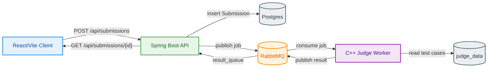

# Distributed Code Judge

End-to-end, locally runnable online judge:

- React/Vite frontend for submitting code and polling results.
- Spring Boot API for storing submissions and managing problems.
- RabbitMQ for job dispatching.
- C++ worker container that compiles/runs submissions against test cases and publishes verdicts.

## Repository layout

- [client/](client/) — React + Vite UI (see [client/README.md](client/README.md))
- [code_judge/](code_judge/) — Spring Boot API (see [code_judge/HELP.md](code_judge/HELP.md))
- [CodeExecutor/](CodeExecutor/) — C++ “judge-worker” container
- [docker-compose.yml](docker-compose.yml) — Postgres + RabbitMQ + worker services
- [stress_test.py](stress_test.py) — simple load generator for the submit endpoint

## Directory structure

```
.
├── client/                 # React/Vite UI
├── code_judge/             # Spring Boot API
├── CodeExecutor/           # C++ judge worker (Docker image)
├── judge_data/             # Local test cases (mounted into worker)
├── docker-compose.yml      # Postgres + RabbitMQ + worker services
├── stress_test.py          # Submit endpoint load generator
└── README.md
```

## Architecture (high level)

1. The frontend calls the backend `POST /api/submissions` with code, `problemId`, username, and language.
2. The backend stores a `Submission` with status `PENDING` and publishes a job to RabbitMQ (`submission_queue`).
3. A C++ worker consumes the job, runs it against test cases, and publishes a result to `result_queue`.
4. The backend listens to `result_queue` and updates the `Submission` as `COMPLETED`.

### Architecture diagram (Mermaid)



## Local development

### Prerequisites

- Docker Desktop (for Postgres/RabbitMQ/worker)
- Node.js 18+ (for the frontend)
- JDK 25 (the backend declares `java.version=25` in [code_judge/pom.xml](code_judge/pom.xml))

### Ports

- Backend API: `http://localhost:8080`
- Frontend dev server: `http://localhost:5173`
- Postgres: `localhost:5433` (mapped to container `5432`)
- RabbitMQ AMQP: `localhost:5672`
- RabbitMQ management UI: `http://localhost:15672` (default creds `guest` / `guest`)

### 1) Start Postgres + RabbitMQ + workers

From the repo root:

- Start infra:
  - `docker compose up -d postgres rabbitmq`
- Build and run workers:
  - `docker compose up -d --build judge-worker`

Scaling workers:

- If you are using Docker Compose (not Swarm), `deploy.replicas` is ignored; scale with:
  - `docker compose up -d --build --scale judge-worker=5 judge-worker`

### 2) Run the backend (Spring Boot)

From the repo root:

- `cd code_judge`
- Windows: `mvnw.cmd spring-boot:run`
- macOS/Linux: `./mvnw spring-boot:run`

The backend reads connection settings from [code_judge/src/main/resources/application.properties](code_judge/src/main/resources/application.properties) and is preconfigured for the Docker Compose ports.

### 3) Create a Problem and upload test cases

Submissions reference a `problemId`. Create a problem first, then upload a zip of test cases.

Create a problem:

```bash
curl -X POST http://localhost:8080/api/admin/problems \
  -H "Content-Type: application/json" \
  -d '{
    "title": "Sample: Add One",
    "description": "Read an integer and output x + 1.",
    "slug": "add-one",
    "difficulty": "EASY",
    "timeLimitSeconds": 2,
    "memoryLimitMb": 256
  }'
```

Upload test cases for `problemId=1`:

```bash
curl -X POST http://localhost:8080/api/admin/problems/1/testcases \
  -F "file=@/path/to/testcases.zip"
```

Zip layout requirements:

- Files must be named `1_in.txt`, `1_out.txt`, `2_in.txt`, `2_out.txt`, etc.
- The backend extracts to `judge.data.path` (configure in `code_judge/src/main/resources/application.properties`).
- The worker reads test cases from `JUDGE_DATA_DIR` (set in `docker-compose.yml`; defaults to `./judge_data` inside the container).

### 4) Run the frontend

From the repo root:

- `cd client`
- `npm install`
- `npm run dev`

The backend enables CORS for `http://localhost:5173` (see `@CrossOrigin` in the submission controller).

## API

### Submit code

- `POST http://localhost:8080/api/submissions`

Example:

```bash
curl -X POST http://localhost:8080/api/submissions \
  -H "Content-Type: application/json" \
  -d '{
    "problemId": 1,
    "username": "demo",
    "language": "python",
    "code": "print(\"hello\")\n"
  }'
```

### Poll submission status

- `GET http://localhost:8080/api/submissions/{uuid}`

```bash
curl http://localhost:8080/api/submissions/<submission-uuid>
```

## Stress test

The script [stress_test.py](stress_test.py) submits many jobs concurrently.

- Install deps: `pip install requests`
- Run: `python stress_test.py`

Adjust `TOTAL_JOBS` and `SLEEP_TIME` inside the script to change load.

## Troubleshooting

- If workers are not processing jobs, check RabbitMQ queues in `http://localhost:15672`.
- If scaling doesn’t work, use `docker compose up --scale ...` (Compose ignores `deploy.replicas`).
- If the backend cannot connect to Postgres/RabbitMQ, verify containers are healthy and that the mapped ports in [docker-compose.yml](docker-compose.yml) match your local config.
